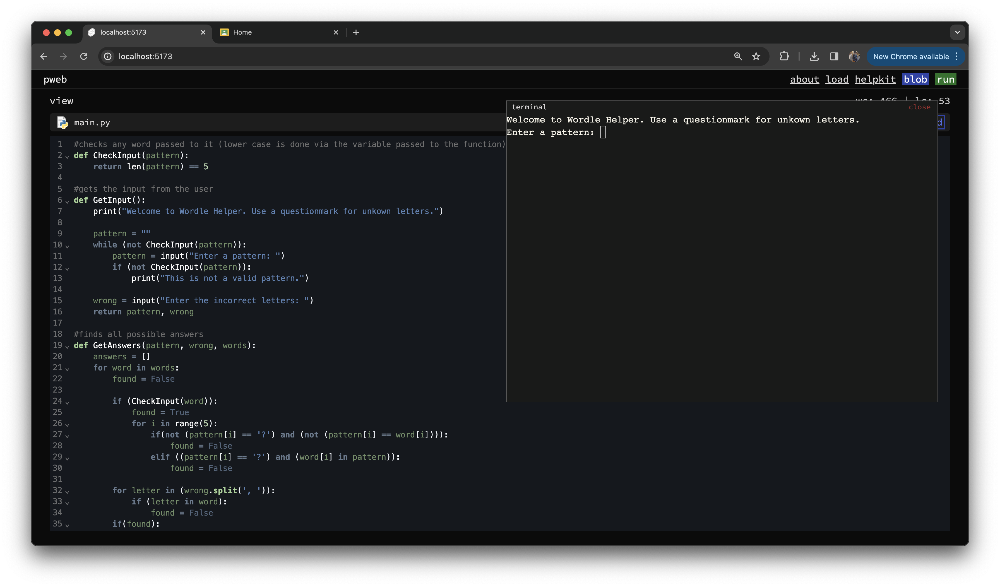

# pwep

pwep is a simple integrated development environment for  single file python programming on the web created with a web assembly python shell emulator via ``pyscript``, ``code mirror`` (code editor) and bundled with python file/blob creation written with ``svelte`` and ``sveltekit``.




### contributing

once you've created a project and installed dependencies with `npm install` (or `pnpm install` or `yarn`), start a development server:

```bash
# for installing dependencies
npm install

npm run dev

# or start the server and open the app in a new browser tab
npm run dev -- --open
```

### building

to create a production version of pweb:

```bash
git clone https://link pweb
cd pweb
npm install
npm run build
```

you can preview the production build with `npm run preview`.

> to deploy pweb locally, you may need to install an [adapter](https://svelte.dev/docs/kit/adapters) for your target environment.
